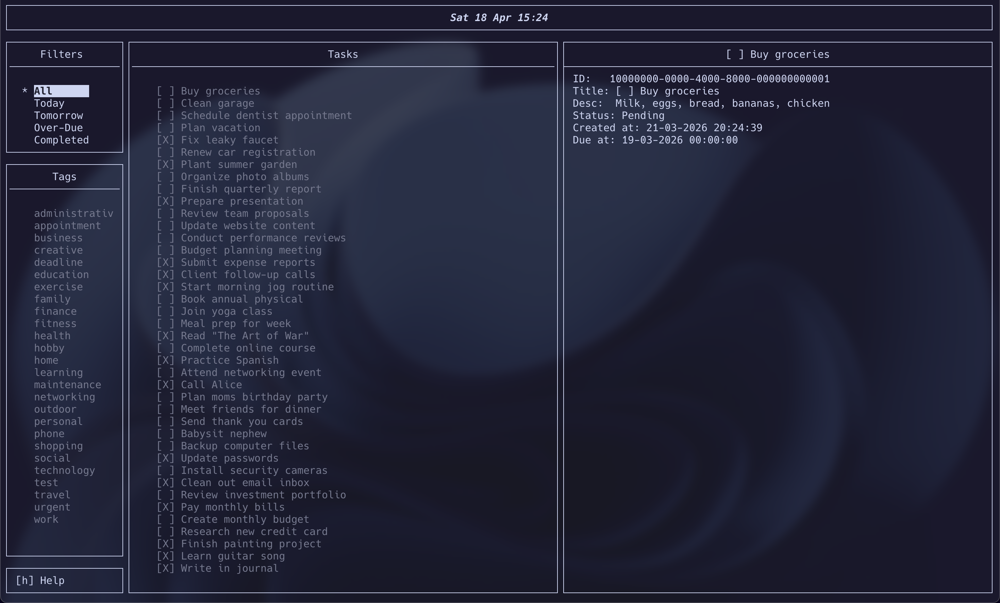

# ToDoist

> **Disclaimer:** This is an independent, open-source personal project and is **not** affiliated with, endorsed by, or associated with the commercial application "Todoist" (by Doist Inc).

A terminal-based task manager written in C, featuring a multi-panel interactive TUI, SQLite persistence, and full CRUD support for tasks and tags.


---

## About

ToDoist is a lightweight, keyboard-driven task manager that lives entirely in your terminal. There is no web server, no Electron wrapper, and no runtime dependency beyond a few system libraries. Tasks are stored locally in an SQLite database and the interface is rendered using the ncurses library stack (menu, form, panel).

The project was built as a deep dive into systems-level C programming — manual memory management, terminal UI rendering, relational data modelling, and a Makefile-based build system with full support for debug, sanitizer, and profiling workflows.

---

## Features

- **Three-panel layout** — Filters sidebar, Tags sidebar, and Task list with a live Details panel
- **Task management** — Create, edit, delete, and toggle status (pending / completed)
- **Tag system** — Assign tags to tasks, filter by tag, add and delete tags on the fly
- **Smart filters** — All, Today, Tomorrow, Overdue, and Completed views backed by SQLite date queries
- **In-place forms** — Add and edit tasks with a multi-field ncurses form including due date validation
- **Live detail view** — Selected task details (title, description, status, due date, created date) update in real time as you navigate
- **Responsive layout** — Detail panel hides on narrow terminals; modal fallback for narrow screens
- **Real-time clock** — Top bar shows current date and time, updated on every key event
- **Terminal resize handling** — Gracefully redraws the full layout on `KEY_RESIZE`
- **UUID primary keys** — Tasks and tags are identified by RFC 4122 UUIDs (via libuuid)
- **Soft deletes** — Deleted records are flagged `is_deleted = 1`, never hard-dropped

---

## Interface



The interface is divided into three focusable panels: a **Filters** sidebar (All, Today, Tomorrow, Over-Due, Completed), a **Tags** sidebar for category-based filtering, a **Tasks** list showing status checkboxes, and a **Details** panel that updates live as you navigate.

---

## Keybindings

| Key | Action |
|-----|--------|
| `↑` / `↓` | Navigate current panel |
| `Tab` | Cycle focus between panels |
| `Enter` | Select filter / tag / confirm action |
| `a` / `A` | Add new task (in Tasks panel) or new tag (in Tags panel) |
| `e` / `E` | Edit selected task |
| `c` / `C` | Toggle task status (pending ↔ completed) |
| `d` / `D` | Delete selected task (in Tasks panel) or tag (in Tags panel) |
| `h` / `H` | Show help overlay |
| `q` / `Q` | Quit |

---

## Project Structure

```
ToDoist/
├── src/
│   ├── main.c          # Entry point — opens DB, initialises TUI
│   ├── database.c      # SQLite layer — schema init, CRUD, queries
│   ├── tui.c           # ncurses TUI — layout, event loop, forms, menus
│   └── utils.c         # Helpers — field buffer trimming, date validation
├── include/
│   ├── database.h      # Task / Tag / MenuData structs, DB function prototypes
│   ├── tui.h           # AppState / FocusableMenu structs, TUI prototypes
│   └── utils.h         # Utility function prototypes
├── data/
│   └── fill.sql        # Seed script — creates schema and inserts mock data
├── .github/
│   └── workflows/
│       └── ci.yml      # GitHub Actions CI — builds on ubuntu-latest
└── Makefile            # Build system — release, debug, asan, valgrind targets
```

---

## Getting Started

### Prerequisites

**Ubuntu / Debian**
```bash
sudo apt install build-essential pkg-config uuid-dev sqlite3 libsqlite3-dev libncurses5-dev libncursesw5-dev
```

**Arch Linux**
```bash
sudo pacman -S base-devel sqlite ncurses util-linux-libs
```

**macOS (Homebrew)**
```bash
brew install sqlite ncurses
```

> On macOS, `uuid` is part of the system SDK — no extra install needed.

### Build and Run

```bash
# Clone
git clone https://github.com/abdellah-darni/ToDoist.git
cd ToDoist

# Build (release)
make

# Seed the database with sample data
make init_db

# Run
make run
```

### Build Targets

| Target | Description |
|--------|-------------|
| `make` | Release build (`-O2`) |
| `make debug` | Debug build (`-g -O0 -DDEBUG`) |
| `make release` | Explicit release build |
| `make run` | Build and run |
| `make asan` | Build with AddressSanitizer |
| `make run-asan` | Run ASAN build, log errors to `logs/asan.log` |
| `make valgrind` | Run under Valgrind, log to `logs/valgrind.log` |
| `make gdb` | Launch in GDB (interactive) |
| `make gdb-report` | Generate GDB crash report to `logs/gdb-report.log` |
| `make init_db` | Initialise / reset the database from `data/fill.sql` |
| `make clean` | Remove build artefacts and logs |
| `make clean-all` | Remove build artefacts, logs, and database |

---

## Database Schema

Three tables with soft-delete support across all of them.

```sql
tasks       (id TEXT PK, title, description, status, due_date, created_at, updated_at, is_deleted)
tags        (id TEXT PK, name UNIQUE, is_deleted)
task_tags   (task_id FK, tag_id FK, updated_at, is_deleted)  -- many-to-many
```

All IDs are RFC 4122 UUIDs. Timestamps are stored as Unix epoch integers. Tasks and tags are never hard-deleted — they are flagged with `is_deleted = 1` so that all read queries filter them out without losing history.

---

## Tech Stack

| Component | Technology |
|-----------|------------|
| Language | C (C11 standard) |
| UI | ncurses, menu, form, panel |
| Database | SQLite 3 (via `libsqlite3`) |
| UUID generation | libuuid |
| Build system | GNU Make |
| CI | GitHub Actions (ubuntu-latest) |
